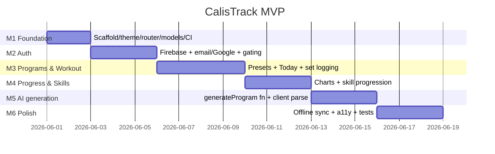

# CalisTrack — Roadmap

> Milestones are tracked as GitHub issue labels (`M1`…`M6`) because milestone
> objects can't be created through the available tooling. Each milestone groups
> its task issues (label `calistrack`).

## Milestone exit criteria

- **M1 Foundation** — App builds; 5-tab shell navigates; models have passing round-trip tests; CI green.
- **M2 Auth** — A new user can register/sign-in (email + Google) and land authenticated; `users/{uid}` created.
- **M3 Programs & Workout** — User can pick a preset program, see today's workout, and log sets (reps + weight).
- **M4 Progress & Skills** — Per-exercise charts render from history; skill steps loggable.
- **M5 AI generation** — Form → Cloud Function → parsed `Program` saved; bad/missing response falls back to a template.
- **M6 Polish** — Works offline and reconciles; loading/error/empty states everywhere; widget tests per feature.

## Review discipline

Every task PR is reviewed by a **fresh zero-context agent** (no build history) that
audits correctness, the repo separation rules, and the spec before merge. Findings are
fixed on the same branch and re-verified by CI.
