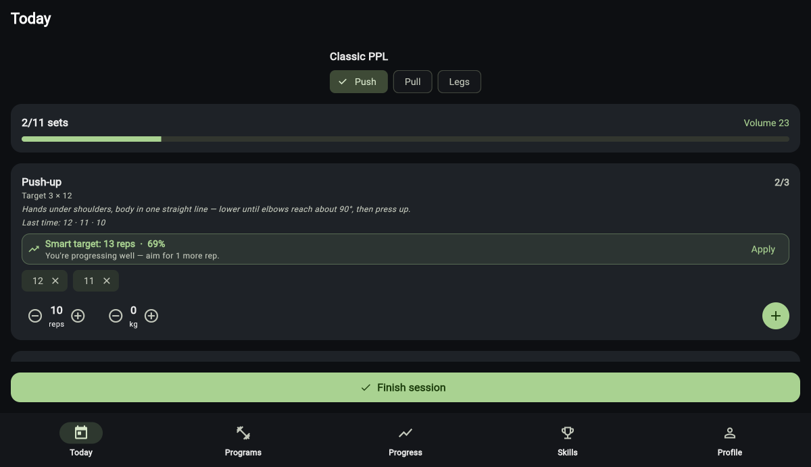
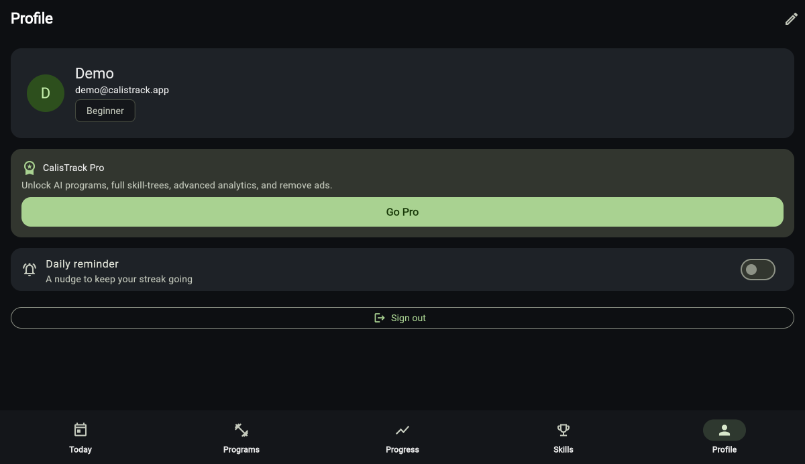

# Live demo — proof shots

Captured from the **deployed web build** (`flutter build web -t lib/preview.dart`)
running in a real browser. This is the $0, Firebase-free PWA that the
`deploy-web` GitHub Action publishes (see [`../DEPLOY-WEB.md`](../DEPLOY-WEB.md)).

## On-device model running live

The **Smart target** line ("13 reps · 69% — You're progressing well — aim for 1
more rep") is the on-device logistic-regression model executing **in the
browser** — pure Dart, no native deps, $0, offline. Seeded history is 12·11·10
(target 3×12), so the model returns `INCREASE` and the rule maps it to "13 reps".

## Freemium surface

The **CalisTrack Pro** card (Go Pro → paywall). AI generation is Pro-gated; ads
are gated on `!isPro`. Real store billing is the owner step (RevenueCat).
