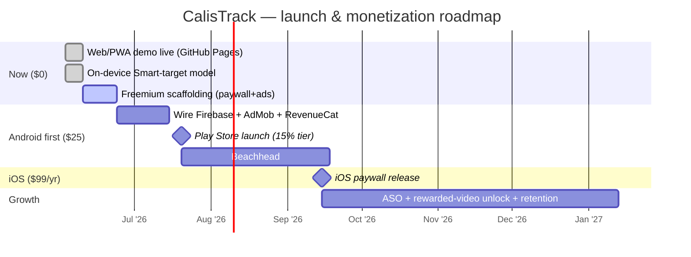
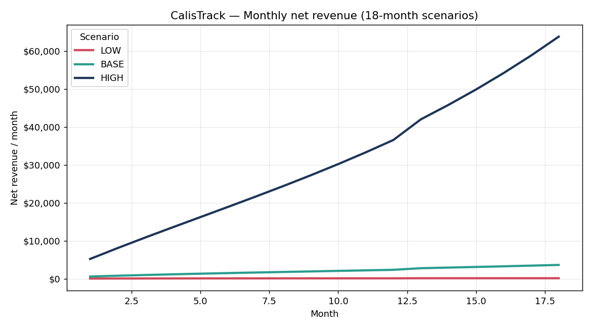
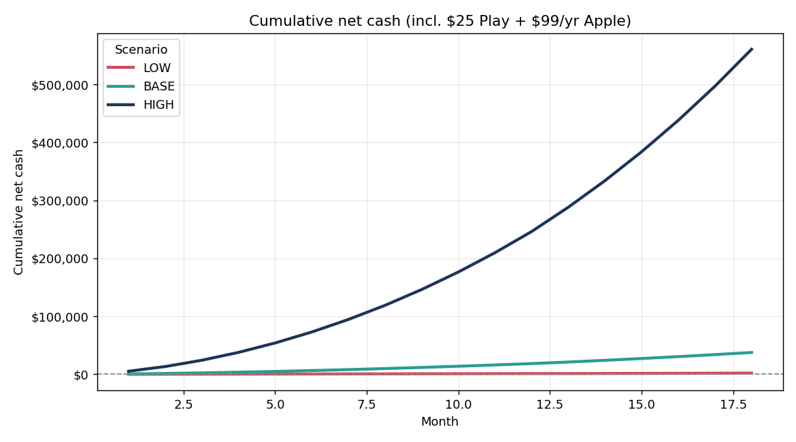
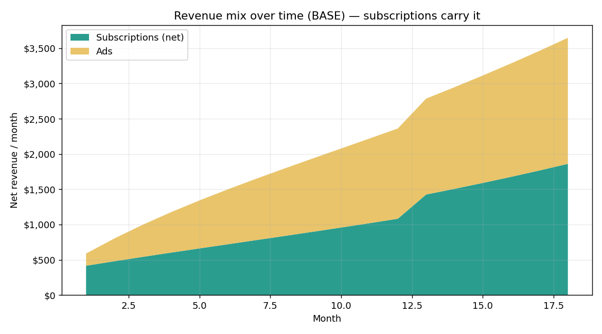
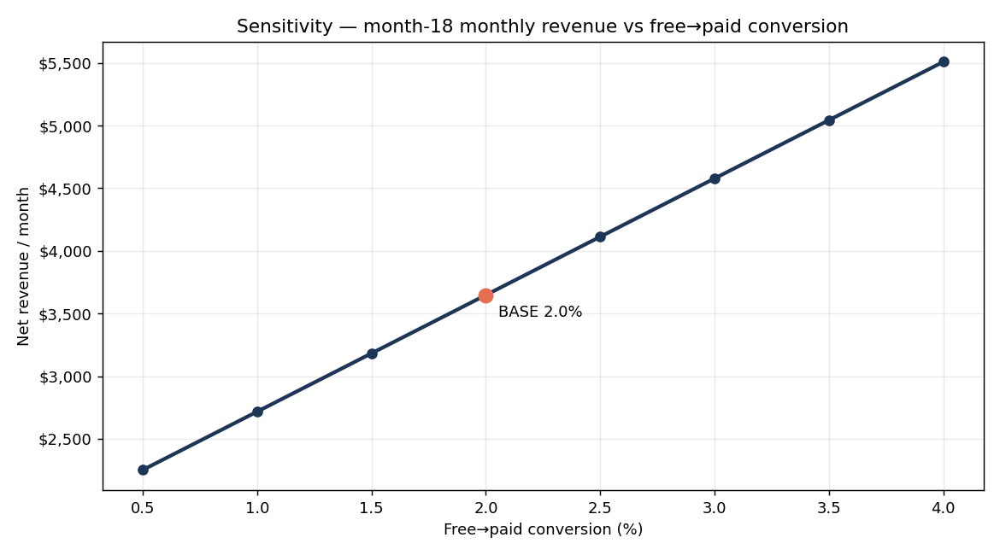
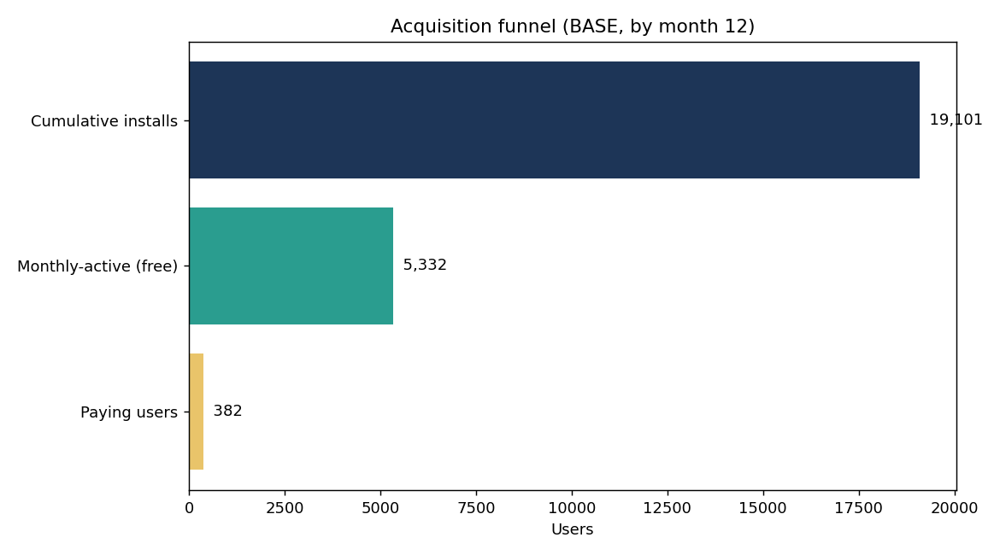

# CalisTrack — Financial Roadmap

**Date:** 2026-06-03 · Companion to the
[strategy brief](../strategy/2026-06-03-monetization-strategy-brief.md).
Charts generated by [`tools/finance/model.py`](../../tools/finance/model.py)
(deterministic; assumptions = brief §7).

> **Read this as a range, not a forecast.** The one input nobody can know up front
> is *monthly organic installs*. So the model runs three coherent scenarios —
> **LOW / BASE / HIGH** — each bundling an install volume, conversion, ad ARPDAU,
> and churn. Truth lands somewhere inside; the levers below decide where.

## Phased plan

## Scenario outcomes (18 months)

| Scenario | Installs/mo (start→grow) | Conv. | Net rev @ M18 | 18-mo cumulative | Payers by M12 |
|---|---|---|---|---|---|
| **LOW** | 300, flat | 1.0% | **~$150/mo** | **~$2.1k** | ~36 |
| **BASE** | 1,200, +5%/mo | 2.0% | **~$3.6k/mo** | **~$37.7k** | ~382 |
| **HIGH** | 4,000, +8%/mo | 3.5% | **~$63.8k/mo** | **~$561k** | ~2,657 |

Net of the 15% store commission; ads are net to the publisher (ARPDAU). Cumulative
cash also subtracts the $25 Google Play and $99/yr Apple fees.

### Monthly net revenue

### Cumulative net cash (the "if you publish" path)

The $25+$99 publish costs are recovered within **month 1** in BASE/HIGH; even LOW
stays cash-positive overall (you only pay Apple's $99 once you choose to ship iOS).
Because the whole stack is **$0 to run** (free hosting + on-device model + Spark
Firebase), there is essentially no burn — only the optional store fees.

### Revenue mix — subscriptions carry it

Ads are a single-digit-percent top-up. This is why the strategy prices and
positions **Pro** carefully and keeps ads low-friction (protecting Day-7
retention, now an ASO ranking factor).

### Sensitivity — conversion is the dominant lever

At BASE install volume, month-18 monthly revenue scales almost linearly with
free→paid conversion. Moving 2.0% → 3.0% is worth ~50% more revenue — so the
paywall placement, the AI-generation hook, and the annual-plan nudge matter more
than squeezing ads.

### Acquisition funnel (BASE, by month 12)

## What moves the needle (in order)

1. **Installs** — the biggest unknown. $0 levers: r/bodyweightfitness + calisthenics
   Discords, a Turkish-language listing ("kalisteni", low ASO competition), and
   keyword-rich screenshot captions (Apple indexes them since Jun 2025).
2. **Free→paid conversion** — paywall the AI generator + full skill-trees; push the
   **annual** plan ($29.99 ≈ $2.50/mo) which drives ~60% of H&F revenue and 2–4× LTV.
3. **Retention (Day-7)** — streaks, skill milestones, the Smart-target nudge. Doubles
   as an ASO ranking input and as the base ads/Pro both monetize.
4. **Ads** — keep as a top-up + a rewarded-video "unlock once" upsell; never let it
   carry the model.

## Risks / honest caveats

- TR-specific eCPM and conversion are **unmeasured**; TR is a retention/reviews
  beachhead, not a revenue center.
- LOW is a real possibility for a solo launch with no paid UA — but downside is
  capped near $0 because there's no burn.
- Subscriptions need the owner-only steps (store accounts, RevenueCat product IDs,
  privacy policy) before a single dollar is collected; the code is ready and waits
  on those.
